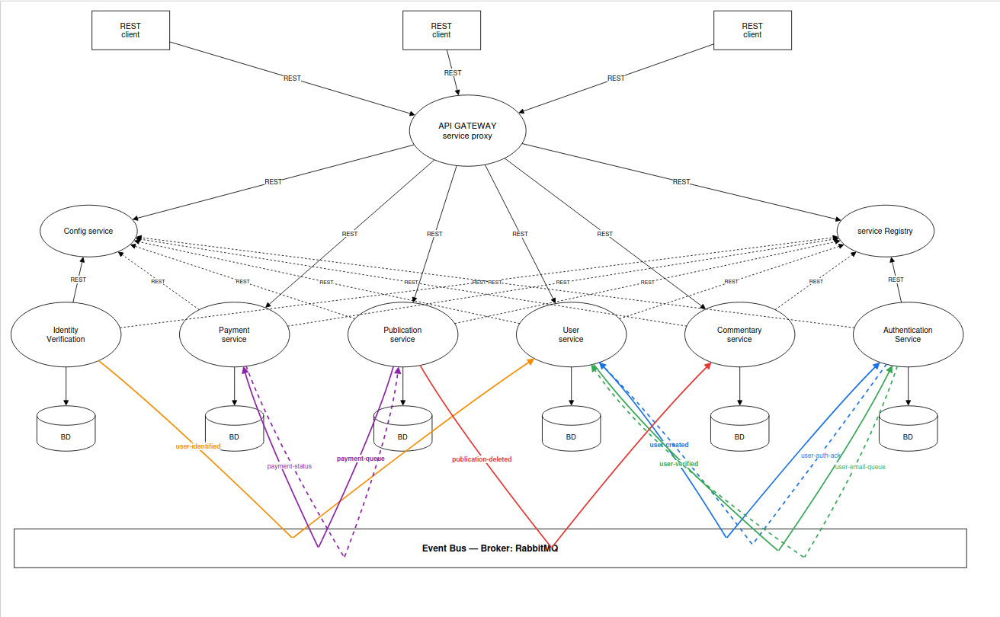
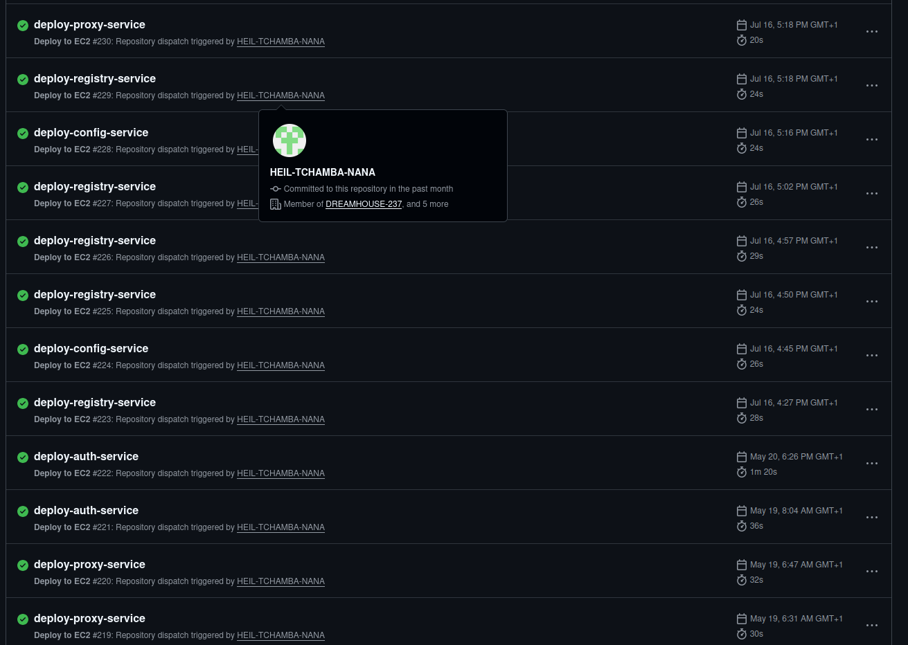

## Why I put myself through this

Let's be real: deploying **9 microservices** on AWS with a budget of $0 is asking for trouble.

But that's the whole point. DreamHouse-237 is my real estate platform project (basically a tiny Zillow clone). I didn't just want "it works on my laptop." I wanted the real thing — real cloud infrastructure, real bugs, and yes, real panic at 11pm wondering why everything was on fire.

I got exactly that. Some nights I genuinely wanted to close the laptop and pretend AWS didn't exist. But I survived, I learned a lot, and looking back, I'm actually a little proud of how messy this journey was. Messy means real.

---

## The architecture, for real

Here's the actual diagram of what I built:



Quick summary: a Gateway sits in front of everything. Eureka keeps track of which services are alive. RabbitMQ lets services send messages to each other without knowing each other directly. And underneath all that, 9 services do their job quietly — except when they don't, which is the whole story below.

---

## The plan that fell apart immediately

My first plan was simple: **one EC2 instance, everything on it.** I genuinely thought AWS Free Tier only gave you one EC2 instance, period, end of story. So my whole plan was "stuff everything onto this one little server and hope it holds."

I started deploying, one service at a time, feeling pretty good about myself. New repo, new container, new little win.

Then, before I had even finished, my instance went offline. Just like that. No warning.

I remember staring at my terminal, refreshing the SSH connection like it was going to magically reconnect if I just tried hard enough. And in that moment, my brain didn't go "huh, that's odd, let me check the logs." It went straight to: *someone is attacking my server.*

I'm not exaggerating — I really believed it. Some random hacker, somewhere, had decided that my half-finished student project was worth taking down. Looking back now, it's almost funny how confident I was in that theory. At the time though? It was genuinely stressful. I felt a bit powerless, like I was fighting an invisible enemy I couldn't even see.

So my fix was simple in my head: delete the instance, make a new one, new IP, problem gone. Surely.

It wasn't gone.

### The loop that wouldn't end

Every time I:

1. Deleted the "hacked" instance
2. Made a brand new one
3. Reinstalled Docker, redid all the setup, redeployed everything from scratch

...the exact same crash came back. Same symptoms. Same sudden silence from the server. And each time, that little spark of hope — "okay, this time it'll be fine" — got crushed a bit faster than the last.

I won't lie, at some point I just sat there frustrated, almost ready to give up on AWS entirely. I remember thinking: *if some random attacker can find and kill a server that's only a few minutes old, with literally nothing pointing to it yet, what's even the point of trying?* That feeling of "I'm doing everything right and it still keeps breaking" is one of the most discouraging feelings in this field, and I felt all of it that week.

> 💭 If your "I'm under attack" theory needs the attacker to already know about a 4-minute-old server with zero visibility — it's probably not an attacker. It's a clue you're reading the problem wrong. I just wasn't ready to see it yet.

### What was actually happening

A few days later, after letting it go for a bit (sometimes stepping away really does help), I came back with a clearer head and actually researched instead of assuming. And honestly, when I found the real answer, I laughed a little at myself. **My server simply didn't have enough memory.**

AWS Free Tier gives you a `t2.micro` instance. That's about **1GB of RAM**, with limited CPU too. I was trying to run 9 microservices (Django, Spring Boot, NestJS, Flask — none of these are light) plus Eureka, RabbitMQ, a Gateway, and Traefik. All of it. On 1GB.

No hacker. No DDoS. Just me, asking a tiny server to do something genuinely impossible, over and over, and being surprised every single time it said no.

There was relief in that discovery, honestly. Relief that nobody was out to get me — but also a little bit of "oh my god, I deleted and rebuilt that server like five times for nothing."

---

## Fix #1 — Splitting the work across two servers

While researching, I found out my first assumption was wrong: Free Tier doesn't limit you to *one* instance forever. The real limit is **total hours per month** (750 hours, enough for one server running all month, or two servers sharing that time).

That single piece of information changed everything for me. I created a **second EC2 instance** and split the work — separating "the brain" (infrastructure) from "the muscle" (business services):

| Instance | Private IP | Role |
|----------|-------------|------|
| **EC2-1** | `172.31.47.28` | App services (Auth, User, Comment, Publication, Payment, Identity) |
| **EC2-2** | `172.31.46.62` | Core infra (Config Server, Eureka, RabbitMQ, Gateway, Traefik) |

The idea: if one service misbehaves, it shouldn't be able to drag Eureka or the Gateway down with it.

### Still not enough

I redeployed everything across both servers, genuinely thinking I'd cracked it. I remember feeling almost proud, like I'd solved the whole mystery.

They still crashed. Just a little less often.

That one stung a bit more than the first round of crashes, honestly — because this time I thought I understood the problem. Turns out understanding *part* of a problem isn't the same as fixing it. Each server still only had 1GB of RAM. Even spread across two machines, it was still too tight.

---

## Fix #2 — Swap memory to the rescue

This is the fix that actually solved it, and the moment things finally started feeling calm: **swap memory.**

Swap is just disk space that the system uses as backup RAM when real memory runs out. It's slower than real RAM, but it gives the system a place to put things instead of just killing processes — or crashing the whole server.

I added **1GB of swap** on each instance:

```bash
# Create a 1GB swap file
sudo fallocate -l 1G /swapfile
sudo chmod 600 /swapfile
sudo mkswap /swapfile
sudo swapon /swapfile

# Make it permanent, even after reboot
echo '/swapfile none swap sw 0 0' | sudo tee -a /etc/fstab
```

That one change turned "random crashes every few hours" into quiet, stable uptime. I remember checking on the servers the next morning, genuinely bracing myself for bad news — and there was none. Just two boring, healthy servers. After everything that had happened, boring felt amazing.

## Fix #3 — Resource limits for every container

Swap gave me breathing room, but I still needed rules — so one greedy container couldn't eat all the memory and starve the rest. I added limits in each `docker-compose.yml`:

```yaml
services:
  auth-service:
    image: yourdockerhub/auth-service:latest
    deploy:
      resources:
        limits:
          cpus: "0.5"
          memory: 256M
        reservations:
          memory: 128M
```

Now every container gets a fair, predictable share instead of fighting for whatever's left.

## Fix #4 — More disk space

Last piece: storage. Free Tier gives you **30GB** total. Between Docker images, logs, and the OS, I was getting close to that limit. So I extended each server's disk to **28GB** — enough room for Docker to breathe, while staying just under the Free Tier cap.

## Watching it all in one place

Once things were stable, I didn't want to go back to "deploy and hope," and honestly, I didn't want to relive that whole panic spiral ever again. So I wrote a small bash script to check both servers at a glance: RAM, CPU, disk space, and which containers were running.


This little script became my peace of mind. Instead of finding out a server was struggling *after* it crashed, I could see memory creeping up early, and fix it calmly instead of panicking at midnight again.

---

## Free HTTPS with Traefik

Nobody wants to pay for SSL certificates on a student budget. **Traefik v3.3** handles that automatically:

- Catches incoming HTTPS traffic
- Gets and renews free Let's Encrypt certificates by itself
- Sends everything to the Gateway internally

My test domain (a free one from [nip.io](https://nip.io), which turns any IP into a working domain name):

```
https://api.16.171.142.15.nip.io
```

No need to buy a real domain just to test something in production. `nip.io` does the job for free — perfect while you're still learning.

---

## One database per service

Each microservice has **its own database**. This is a basic microservices rule: if services share one database, you've secretly rebuilt a monolith with extra steps.

| Database | Owned by |
|----------|----------|
| `auth_db` | Authentication |
| `user_db` | User Service |
| `commentary_db` | Commentary Service |
| `publication_db` | Publication Service |
| `payment_db` | Payment Service |

All of these live inside one **RDS MySQL** server (one server, several databases — still inside the Free Tier).

---

## The frontend lives somewhere else

The frontend (React) isn't on AWS at all. It's hosted for free on **Render**:

```
https://dreamhouse237.onrender.com
```

Why? Because keeping frontend and backend on different hosts is how it's usually done in real companies. It also saves my AWS resources for things that actually need them.

---

## CI/CD — how things get deployed automatically

Nothing here gets deployed by hand (well, almost nothing — more on that in the Eureka walkthrough 👀).

My GitHub organization, **`DREAMHOUSE-237`**, contains:

- **13 repositories** — one per service, plus one `config` repo for shared settings
- **Shared secrets at the organization level** — like `DOCKERHUB_USERNAME` and `DOCKERHUB_TOKEN`, set once and reused everywhere, instead of copy-pasting them into every repo
- **Docker Hub** as the place where all the built images live

Here's the simple version of the flow:

```
push to "dev"
   → GitHub Actions builds and tests the code
   → a Docker image gets built
   → that image is pushed to Docker Hub
   → if tests pass, "dev" merges into "main" automatically
   → this triggers a signal to the "infrastructure" repo
   → that repo deploys the new version on EC2-2
```



The first time I watched this whole pipeline run green from start to finish, without touching anything myself, I actually felt a little rush of pride. It's a small thing, but seeing a robot do the boring, repetitive work I used to do by hand never really gets old.

I'll go deeper into this pipeline in its own walkthrough — there were some real headaches with token permissions along the way.

---

## A security wake-up call

Here's a story that still gives me a slight chill thinking about it. At some point, I noticed strange connections in the RabbitMQ logs, coming from IPs owned by **Censys** and **Shodan** — these are search engines that scan the entire internet, all day, looking for open ports that shouldn't be open.

The problem: port `5672` (RabbitMQ) was open to **everyone**, not just my own servers. Anyone, anywhere, could try to connect to it. Knowing that strangers had already been quietly poking at my server, without me noticing for who knows how long, was honestly a bit unsettling.

**The fix:**

```
Before: 0.0.0.0/0  → open to the whole internet 😬
After:  172.31.47.28/32  → only reachable from EC2-1
```

> 🛡️ **The simple rule I learned**: only open what truly needs to be public — in my case, just the Gateway, through Traefik. Everything else (RabbitMQ, individual services, the database) should stay private, inside AWS's internal network.

---

## What this would actually cost in real life

Just for fun, I used the **AWS Pricing Calculator** to check what this setup would cost outside of Free Tier — say, if I had to run this for a real client one day:

| What | Estimated cost/month |
|------|----------------------|
| EC2 (all servers) | ~$125 |
| RDS (database) | ~$61 |
| S3 (file storage) | ~$3 |
| CloudFront (CDN) | ~$9 |
| Disk storage | ~$20 |
| Internet traffic (200GB) | ~$18 |
| **Total** | **~$236/month** |

I'm not paying $236 a month as a student — I stay carefully inside Free Tier. But it's a useful exercise: knowing the real cost means I won't be shocked the day I have to quote this kind of setup for an actual client.

---

## What I learned from all of this

Looking back at this whole rollercoaster, a few things really stuck with me:

- **Check your metrics before blaming an attacker.** "I'm under attack" felt exciting and even a little dramatic at the time. "My server only has 1GB of RAM" was the boring truth, and accepting that took me longer than it should have.
- **AWS Free Tier is more flexible than people think** — look at the actual hour limits instead of assuming you're stuck with one server, like I wrongly did.
- **Swap memory is a normal tool**, not a hack, especially when you're working with small servers — which, as a student, is most of the time.
- **Resource limits per container matter**, even on a small project. One greedy container can take everything down with it.
- **Watching your servers beats guessing.** A tiny script saved me from repeating that same delete-and-rebuild panic loop all over again.
- **Security isn't optional**, even on a "just a student project" setup. Scanners will find any open door, fast, and they don't care how small your project is.

But maybe the biggest thing I learned isn't technical at all: it's that feeling lost and frustrated for days doesn't mean you're failing. It usually just means you haven't found the real question yet. Once I stopped asking "who's attacking me" and started asking "what does my server actually have access to," everything clicked.

---

## What's next

With the infrastructure finally stable, I could focus on making all these services actually talk to each other. Coming up next:

- 🔍 **Eureka & Service Discovery** — getting every service to find the others (and the NestJS bug that ruined one of my evenings)
- 🐰 **RabbitMQ & Messaging** — how Auth and User stay in sync without ever calling each other directly
- 🚪 **Gateway, JWT & Security** — how one single token safely travels across the whole system
- 🐛 **The Django/Gunicorn deadlock** — my worst bug, and how I finally tracked it down

On to the next one 👇
