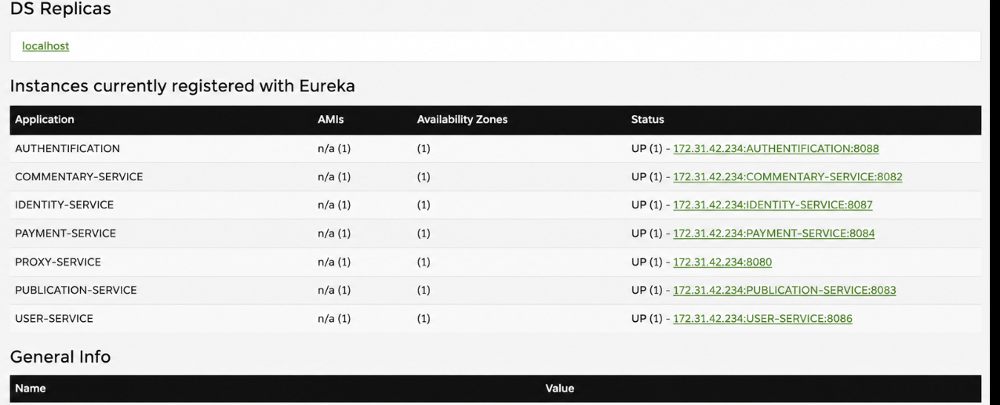

## The trust I had in a green dashboard

After finally getting the infrastructure stable (RAM, swap, resource limits — the whole saga from walkthrough #1), I moved on to the part I was actually excited about: making all these services *talk to each other*.

On paper, this is the easy part. Every service registers with **Eureka**. The **Gateway** looks a service up by name (`lb://SERVICE-NAME`) and Spring Cloud LoadBalancer handles the rest. No hardcoded IPs, no manual wiring. I'd done this before in coursework, I knew the theory, I felt confident.

I was not ready for how much trust I had put in a green "UP" badge on a dashboard.

---

## The setup

Every service points to a shared **Config Server** before it does anything else:

```properties
spring.application.name=service-enregistrement
spring.cloud.config.uri=http://ec2-16-171-42-48.eu-north-1.compute.amazonaws.com:8888
spring.config.import=configserver:
```

And the Eureka server itself is about as minimal as it gets:

```properties
server.port=8761
eureka.client.register-with-eureka=false
eureka.client.fetch-registry=false
```

Once services start registering, the dashboard fills up with green:



Every service, `UP`. Clean, reassuring, boring in the best way. I remember genuinely thinking the hard part was behind me.

It wasn't.

---

## The evening COMMENTARY-SERVICE broke my brain

`COMMENTARY-SERVICE` is the one service in the whole architecture written in **NestJS**, sitting next to a stack of Spring Boot services. And one evening, every request the Gateway sent to it came back with a flat, contextless **404**.

The dashboard said `UP`. The container was running, logs looked fine, health checks were green. By every signal I knew how to check, the service was *fine*. And yet the Gateway acted like it didn't exist.

I did what you do when you don't trust your own diagnosis: I restarted the container. Then I restarted the Gateway. Then I restarted both, in different orders, like that was somehow going to change anything. It didn't. I re-read the route config character by character, convinced I'd typo'd a path. I hadn't.

> 💭 A couple hours in, I caught myself doing the exact same thing I did with the "hacker" theory in walkthrough #1 — staring at a green light and refusing to believe it was lying to me, instead of asking what that green light was actually measuring.

### What the green badge doesn't tell you

Here's the part that took me way too long to internalize: **Eureka's `UP` status only means the service answered a heartbeat.** It says nothing about whether the *name* it registered under matches the name the Gateway is asking for.

Spring Boot handles this invisibly — `spring.application.name` gets picked up and normalized automatically into the Eureka `appname`, consistently, every time, across every Spring service in the project. It's so automatic you forget it's even a step.

NestJS has no such thing. There's no Spring convention baked in — registering with Eureka from a Node/NestJS service means writing that logic yourself, and nothing enforces that the name you send matches the casing convention the rest of your Spring-based fleet expects. `COMMENTARY-SERVICE` had registered itself under a name that didn't line up with what the Gateway's route (`lb://COMMENTARY-SERVICE`) was expecting — close enough to look right at a glance, different enough to fail every single resolution.

Eureka didn't care. It stored whatever name it was given and happily reported the instance as healthy. The mismatch only became visible one layer up, at the exact point where the Gateway tries to resolve that name to an actual instance — the one place I hadn't thought to double check, because the dashboard had already told me everything was fine.

### The fix

Once I saw it, the fix itself was almost anticlimactic: align the app name the NestJS client registers with Eureka to match the exact convention every other service already followed. No route hacks, no gateway changes — just make the one inconsistent service speak the same dialect as everyone else.

It's a small fix that took an embarrassingly large number of hours to get to, mostly because I kept re-checking the wrong layer.

---

## A second, quieter case-sensitivity ghost

Weeks later, a related but separate issue showed up — this time not from a service I'd built, but from an external caller I don't control: the **Campay** payment webhook.

Campay called the payment endpoint in lowercase (`/payment-service/...`), while every internal route followed the project's uppercase convention (`/PAYMENT-SERVICE/...`). Same category of bug — casing breaking a name-based lookup — but a different root cause: this time the service itself was registered correctly, it was the *caller* that didn't follow the convention. Identity-service had the same problem, triggered from a different context.

Since I don't control how Campay formats its webhook URLs, "fix the caller" wasn't an option. So instead of renaming anything, I gave the Gateway a second route for each affected service, covering the lowercase variant and pointing it at the exact same backend:

```properties
# ---- PAYMENT SERVICE ----
spring.cloud.gateway.routes[6].id=payment-service
spring.cloud.gateway.routes[6].uri=lb://PAYMENT-SERVICE
spring.cloud.gateway.routes[6].predicates[0]=Path=/PAYMENT-SERVICE/**
spring.cloud.gateway.routes[6].filters[0]=RewritePath=/PAYMENT-SERVICE/(?<segment>.*), /${segment}

# ---- PAYMENT SERVICE (lowercase - Campay webhook) ----
spring.cloud.gateway.routes[8].id=payment-service-lower
spring.cloud.gateway.routes[8].uri=lb://PAYMENT-SERVICE
spring.cloud.gateway.routes[8].predicates[0]=Path=/payment-service/**
spring.cloud.gateway.routes[8].filters[0]=RewritePath=/payment-service/(?<segment>.*), /${segment}
```

Both routes point at the same `lb://PAYMENT-SERVICE` — no duplicated business logic, just a bit of tolerance built into the entry point for a caller I can't ask to change its behavior. Not the "cleanest" fix on paper, but the realistic one when part of your traffic comes from outside your own conventions.

---

## What I learned from all of this

- **`UP` on Eureka is a heartbeat, not a promise of reachability.** It tells you the service is alive. It says nothing about whether its registered name actually matches what's calling it.
- **Consistency you get for free is still a decision someone made.** Spring Boot's auto-normalization felt invisible until I had one service outside that ecosystem — then I understood exactly how much work that convention was quietly doing for me.
- **Not every mismatch has the same root cause, even when the symptom looks identical.** One 404 came from my own service registering inconsistently; another came from an external caller I have zero control over. Same shape of bug, two completely different fixes.
- **When a bug "makes no sense," check a layer you haven't looked at yet.** I spent hours staring at the service and the container. The actual mismatch was living one step further up, at the name-resolution boundary between Eureka and the Gateway.

---

## What's next

With service discovery finally behaving, the next piece was getting services to talk to each other *without* the Gateway in the middle — which meant finally facing RabbitMQ.

- 🐰 **RabbitMQ & Messaging** — how Auth and User stay in sync without ever calling each other directly
- 🚪 **Gateway, JWT & Security** — how one single token safely travels across the whole system
- 🐛 **The Django/Gunicorn deadlock** — my worst bug, and how I finally tracked it down

On to the next one 👇
